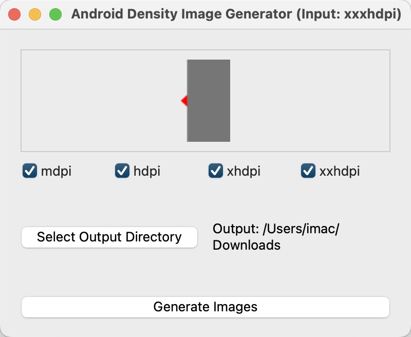

<div align="center">
    
    <h1>DensityDrop</h1>
    <p>Generate Android drawable resources for multiple densities from a single image.</p>
    <p>从单个图像生成多种密度的 Android drawable 资源。</p>
</div>

---

[English](#english) | [中文](#中文)

<a id="english"></a>
# DensityDrop

A simple Python utility to generate Android drawable resources for different densities from a single XXXHDPI source image.

## Preview

<div align="center">
    
</div>

## Features

*   Drag and drop an image file (assumed to be XXXHDPI).
*   Select target densities (MDPI, HDPI, XHDPI, XXHDPI, XXXHDPI).
*   Generates resized images into corresponding `drawable-*` folders.
*   Defaults to saving in a `generated_drawables` subfolder within the application directory.
*   Option to choose a custom output directory.
*   Clears the default output directory before each generation (if the default path is used).
*   Features a custom application icon.

## Requirements

*   Python 3.x
*   PyQt6
*   Pillow

## Installation

1.  **Clone the repository (or download the files):**
    ```bash
    git clone https://github.com/SinoMiles/DensityDrop.git
    cd DensityDrop
    ```
2.  **Create and activate a virtual environment (Recommended):**
    ```bash
    # On macOS/Linux
    python3 -m venv venv
    source venv/bin/activate

    # On Windows
    python -m venv venv
    .\venv\Scripts\activate
    ```
3.  **Install dependencies:**
    ```bash
    pip install -r requirements.txt
    ```

## Usage

1.  **Run the application:**
    ```bash
    python main.py
    ```
2.  **Drag & Drop:** Drag your XXXHDPI source image onto the designated area in the application window.
3.  **Select Densities:** Ensure the checkboxes for the desired output densities are selected (defaults to all).
4.  **Select Output Directory (Optional):**
    *   By default, images are saved to a `generated_drawables` folder where the script is located. This folder is cleared before generation.
    *   Click "Select Output Directory" to choose a different location. Custom locations are *not* cleared automatically.
5.  **Generate:** Click the "Generate Images" button.

The generated images will be placed in subfolders like `drawable-mdpi`, `drawable-hdpi`, etc., within the chosen output directory.

## License

This project is released under the MIT License. See the LICENSE file for details.

## Contributing

Contributions are welcome! Please feel free to submit a Pull Request.

---

<a id="中文"></a>
# DensityDrop

一个简单的 Python 工具，用于从单个 XXXHDPI 源图像生成不同密度的 Android drawable 资源。

## 预览

<div align="center">
    
</div>

## 特性

*   拖放图像文件（假定为 XXXHDPI 密度）。
*   选择目标密度（MDPI, HDPI, XHDPI, XXHDPI, XXXHDPI）。
*   将缩放后的图像生成到相应的 `drawable-*` 文件夹中。
*   默认保存到应用程序目录下的 `generated_drawables` 子文件夹中。
*   可以选择自定义输出目录。
*   每次生成前会清空默认输出目录（如果使用默认路径）。
*   具有自定义应用程序图标。

## 需求

*   Python 3.x
*   PyQt6
*   Pillow

## 安装

1.  **克隆仓库（或下载文件）:**
    ```bash
    git clone https://github.com/SinoMiles/DensityDrop.git
    cd DensityDrop
    ```
2.  **创建并激活虚拟环境（推荐）:**
    ```bash
    # 在 macOS/Linux 上
    python3 -m venv venv
    source venv/bin/activate

    # 在 Windows 上
    python -m venv venv
    .\venv\Scripts\activate
    ```
3.  **安装依赖:**
    ```bash
    pip install -r requirements.txt
    ```

## 使用方法

1.  **运行应用程序:**
    ```bash
    python main.py
    ```
2.  **拖放:** 将您的 XXXHDPI 源图像拖到应用程序窗口中的指定区域。
3.  **选择密度:** 确保勾选了所需输出密度的复选框（默认全选）。
4.  **选择输出目录（可选）:**
    *   默认情况下，图像会保存到脚本所在位置的 `generated_drawables` 文件夹中。每次生成前会清空此文件夹。
    *   点击"选择输出目录"选择不同的位置。自定义位置不会自动清空。
5.  **生成:** 点击"生成图像"按钮。

生成的图像将放置在所选输出目录内的 `drawable-mdpi`、`drawable-hdpi` 等子文件夹中。

## 许可证

本项目基于 MIT 许可证发布。有关详细信息，请参阅 LICENSE 文件。

## 贡献

欢迎贡献！请随时提交 Pull Request。 